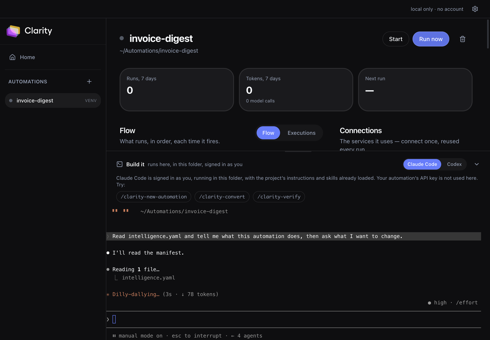
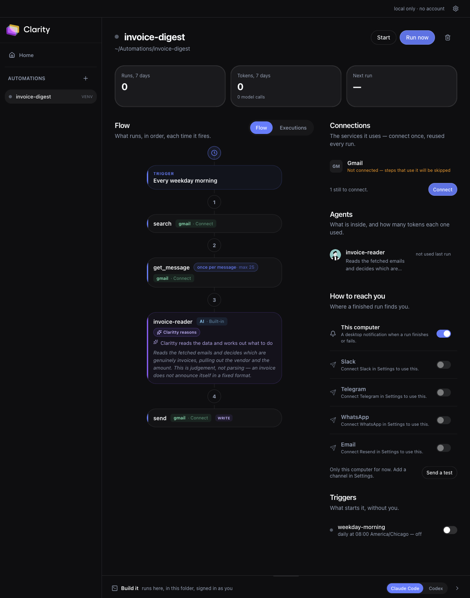
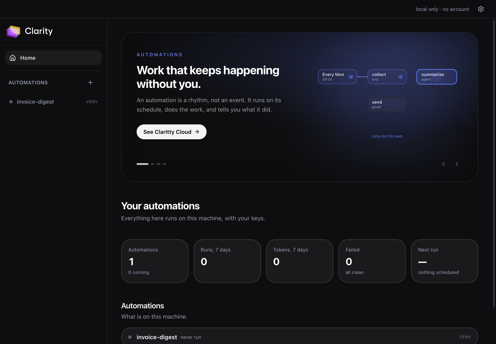
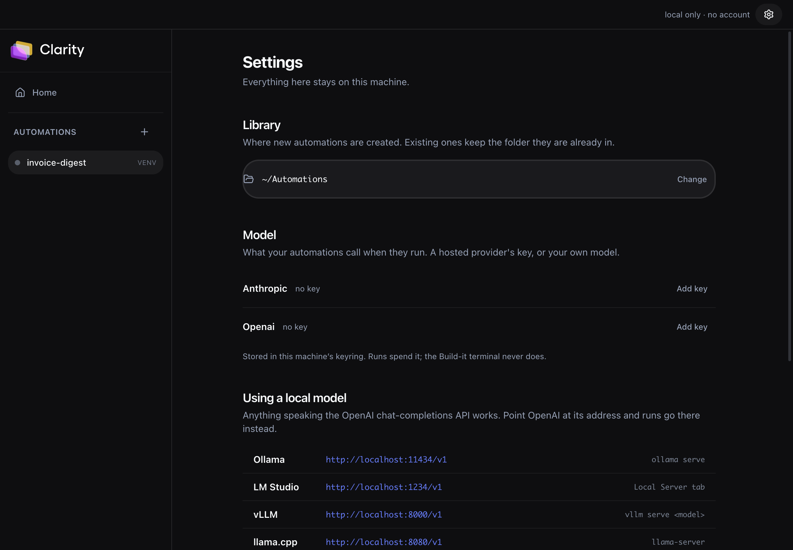

# Clarity Studio

**Build, run, schedule and observe AI automations on your own machine, with your own keys.**

Clarity Studio is an open-source desktop app for agentic automations — the ones that keep working
after you close the laptop lid. Write them with the coding agent you already use, run them in Docker,
give them real schedules and webhooks, connect them to real services, and watch every step, token and
dollar they spend.

> **No accounts. No login. No telemetry. No phoning home.**
> Studio talks to exactly two kinds of remote host: the LLM provider whose key *you* configured, and
> the third-party APIs *your* automation calls. Nothing else, ever.

---



*A real automation: a weekday trigger, a Gmail search, a fan-out that hydrates each message
(`once per message · max 25`), an agent that decides what counts as an invoice, and a send marked
`write` so a dry run previews it instead of mailing anyone.*

*The right column is honest about what this machine can reach. Studio wires thirteen connectors
from `packages/connectors` — Slack, Gmail, Jira, GitHub, Notion, Linear, Stripe, Brave Search,
Telegram, WhatsApp and friends — by holding their credentials in the OS keyring and brokering every
call, so an automation never sees a key. Gmail and Jira use **your own** app, not ours: there is no
Claritty OAuth client to sign into. Anything the catalog names but Studio cannot broker says so,
rather than printing a command that will always fail.*



*Everything an automation needs from you, in one column. Accounts are connected once in Settings and
shared by every automation. A finished run reports through whichever channels you switch on — and a
channel with no credentials cannot be switched on at all, because a toggle that silently sends
nothing is the failure a notification exists to prevent. Schedules arrive **off**: an automation
that started running because you opened its page would be your machine doing work you never asked
for.*



*Home: what is actually on this machine — runs, tokens, failures, the next scheduled fire — and
underneath, what the hosted version adds.*



*Bring your own model: a provider key in the OS keyring, or point it at your own
OpenAI-compatible endpoint — the exact request Studio sends is written down in
[docs/model-endpoint.md](docs/model-endpoint.md). Ollama, LM Studio, vLLM and llama.cpp addresses are listed, with the
exact request Studio sends so you can check it with `curl` before trusting a run to it.*

---

## Getting started

Three stages, and **each one buys a specific capability**. Most tools open with
"first, get an API key" — you can get further than that here before spending
anything, and it is worth doing in order so that when something breaks you know
which layer broke.

### 1. Run one, with no credentials at all

Needs **Node 22+**, **pnpm** and **Python 3.12+**.

```bash
pnpm install && pnpm build && pnpm package
open "apps/desktop/release/mac-arm64/Claritty Studio.app"
```

Press **New automation**, call it `downloads-report`, and say: *"every weekday
evening, look through my Downloads folder, group what's there by kind and age,
and write me a short report."* Then press **Run now**.

No model key. No account. Nothing connected. That run proves the machine works —
the Python runtime, the workflow engine, the step timeline — so anything that
fails later is about a credential rather than the install.

### 2. Add a model, and the agents wake up

**Settings → Model.** An Anthropic or OpenAI key, or your own endpoint.

Until now every step has been deterministic Python. A model is what lets an
automation *decide* — which of these emails is a real request, which of these
results matter, is this the same issue as that one. That judgement is the reason
to use Studio rather than a cron job.

Running your own server instead? The exact request Studio sends is written down
in [docs/model-endpoint.md](docs/model-endpoint.md). Anything OpenAI-compatible
works, but test it with tools before trusting it with an agent — a server that
answers prose perfectly can still drive agents that never call a tool.

### 3. Connect a service, and it reaches the world

**Settings → Connections.** Thirteen services, each with the exact steps in
[docs/connectors.md](docs/connectors.md) — generated from the connector specs, so
it cannot drift from what the app asks you for.

Credentials go to your OS keyring and are **brokered**: the automation's own
process never sees a key. Where a service needs an OAuth app — Gmail, Jira,
WhatsApp — **you create your own**. There is no Claritty client id to sign into.

### Then give it a schedule

Open the automation, find **Triggers**, and throw the switch. They arrive off on
purpose: an automation that started running because you opened its page would be
your machine doing work you never asked for.

One limit to know up front — **schedules fire only while Studio is open.** The
dispatcher lives in the app. For unattended runs, `clarity-studio serve` keeps
one automation going headless.

---

## Local or hosted

Studio is the whole product locally. The hosted version at
[claritty.ai](https://claritty.ai) is for the parts a laptop cannot do.

| | Clarity Studio | Claritty Cloud |
| --- | --- | --- |
| Runs your automations | on your machine | on ours, always on |
| Your keys | your OS keyring, brokered | managed, brokered |
| Schedules | while the app is open | unattended |
| Webhooks | headless CLI only | hosted endpoints |
| Integrations | 13, with your own OAuth apps | the full catalog, sign-in only |
| Sharing, teams, marketplace | — | yes |
| Cost | free, your model spend | plans |

You do not need an account to use everything above, and nothing here reports
back — [see for yourself](#why-this-exists).

---

## Working headless

The CLI runs the same automations without the app, for a server or a terminal.

```bash
pnpm setup                       # checks the machine, builds, prepares Python
pnpm spike                       # proves an automation runs against the local control plane
```

Then make one and run it:

```bash
node apps/cli/dist/index.js new my-automation
cd my-automation

# Check the wiring — no model, no key, nothing spent
node ../apps/cli/dist/index.js run --native --simulate
```

```
✓ my-automation v1.0.0 on http://127.0.0.1:33000
→ running daily-digest…

  Run timeline
  ──────────────────────────────────────────────────────────────────────
  ● write                success   213ms
  ──────────────────────────────────────────────────────────────────────
  3 model call(s) · 1515 in / 0 out · $0.00 · 0.3s wall
✓ workflow succeeded — {"digest_id":"dg_9bbe05dce9b1", …}
```

To run it for real, give the control plane a key and drop `--simulate`:

```bash
export ANTHROPIC_API_KEY=sk-ant-…      # or OPENAI_API_KEY / GOOGLE_API_KEY
node ../apps/cli/dist/index.js run --native
```

Now open the folder in Claude Code or Codex and tell it what you actually want
the automation to do. `CLAUDE.md`, `AGENTS.md` and `.cursorrules` are already
there, so the agent knows the rules; `/clarity-new-automation` and
`/clarity-convert` are ready as slash commands.

**Two runtimes.** `--native` uses a local Python virtualenv, so Studio is
useful a minute after download on a machine that has never seen Docker. Drop
the flag and it runs the automation in its container instead — the same one it
would run in on a server, which is what you want before you trust it with a
schedule.

**About your keys.** They are read by the local control plane and *never* given
to the automation. The container gets a local, revocable token and nothing
else, so a compromised image yields no credential. That is the same trust model
the hosted platform uses, which is why an automation that works here works
unchanged anywhere.

### Make it run on its own

This is the part other agent harnesses don't do.

```bash
node ../apps/cli/dist/index.js trigger add --daily 09:00
node ../apps/cli/dist/index.js serve --native
```

`serve` holds the automation up, ticks every 15 seconds, and fires anything
that's due. Close the terminal and nothing runs — that's a property of your
laptop, not a limitation we chose. When Studio starts again it tells you what
it missed rather than pretending nothing happened.

Webhooks land on the same process:

```bash
node ../apps/cli/dist/index.js trigger add on-event      # a WEBHOOK trigger
# → http://127.0.0.1:4319/webhooks/<instance-id>
curl -X POST http://127.0.0.1:4319/webhooks/<id> -d '{"hello":"world"}'
```

Every delivery is stored whole — headers and body — **before** it is forwarded.
So when one fails at 2am, you don't ask the sender to please do it again:

```bash
node ../apps/cli/dist/index.js deliveries
node ../apps/cli/dist/index.js replay <delivery-id>
```

Deliveries that arrive while the automation is down are still recorded, and
answered with a 503 rather than a 404 — nothing is lost, and you replay them
once it's back.

Other commands: `doctor` (check this machine), `ps` (your automations),
`runs` (recent runs with cost), `trigger ls|rm`, `up`, `help`.

## Why this exists

Agent harnesses today are development scratchpads — great for running coding agents side by side,
useless the moment you want something to happen at 9am on Tuesday. Studio is built for the other
half: automations that run on a schedule, react to webhooks, hold credentials, and need to be
debugged six weeks after you wrote them.

|  | Coding-agent harnesses | **Clarity Studio** |
|---|---|---|
| Runs agents in parallel | ✅ | ✅ |
| Git worktree isolation | ✅ | ✅ |
| Fires on a schedule | ❌ | ✅ |
| Survives DST without drifting | ❌ | ✅ |
| Webhook ingress + **replay** | ❌ | ✅ |
| Credential vault for third-party APIs | ❌ | ✅ |
| Per-step run traces, tokens and cost | ❌ | ✅ |
| Portable artifact you can host anywhere | ❌ | ✅ |

## How it works

Every automation is a plain git repo containing an **`intelligence.yaml`** — a declarative manifest of
five primitives:

```yaml
schemaVersion: 2
id: overdue-invoice-chaser

integrations: [{ id: gmail, required: true }]

tools:
  - id: app.list_overdue
    handler: backend.tools.list_overdue:run
    output: { invoices: { type: array, required: true } }

agents:
  - id: chaser
    tools: [app.list_overdue, gmail.send]
    promptFile: backend/agents/chaser.md

workflows:
  - id: chase
    steps: [{ id: run, agent: chaser }]

triggers:
  - id: weekday-morning
    type: SCHEDULE
    workflow: chase
    supportedSchedules: [DAILY]
    configFields:
      - { key: time, type: time, required: true, label: "Run at", default: "09:00" }
      - { key: timezone, type: timezone, required: true, label: "Timezone" }
```

The runtime that executes this is [`claritty-sdk`](https://pypi.org/project/claritty-sdk/) (MIT, on
PyPI). Studio runs a **local control plane** on `127.0.0.1:4319` that serves the SDK everything it
needs — model calls routed to your own provider key, credentials from your OS keychain, run
checkpoints, traces — so the automation runs unmodified on your machine.

That last property is the point: the automation is a portable artifact. `docker compose up` works
without Studio. Your own server works. So does Clarity Cloud, if you ever want always-on schedules.
Nothing here locks you in either direction.

## Status

Pre-alpha, built in the open. See [`docs/ROADMAP.md`](docs/ROADMAP.md).

- ✅ **M0** — local control plane + automation seed
- ✅ **M1** — local store, Docker and native runtimes, the `clarity-studio` CLI
- ✅ **M4** — scheduler, webhook ingress and replay
- ✅ **M2** — Electron shell, design system, run timeline as a waterfall
- ✅ **M3** — credential vault, connector engine, eight integrations
- ◐ **M5** — intelligence canvas and agent detection done; embedded terminal outstanding
- **M6** — import & convert existing agents, signed installers ← next

## Working on Studio itself

`CLAUDE.md` in the repo root is the contract for anyone — human or agent —
changing this codebase: architecture, invariants, the traps that cost real time
to find, six ways the upstream SDK's own docs are wrong, and an honest list of
what has never been executed. `AGENTS.md` is the short version.

If you open this repo in Claude Code, Codex or Cursor, they read those on their
own. `.claude/settings.json` pre-approves the build and test commands so a
session is not stopped for permission on every `pnpm test`.

## Repository layout

```
apps/desktop/              Electron app
apps/cli/                  clarity-studio — the same core, headless
packages/control-plane/    the local Clarity runtime the SDK talks to
packages/orchestrator/     Docker lifecycle, ports, logs, health
packages/automation-seed/  the MIT seed every new automation starts from
packages/connectors/       declarative HTTP connector engine + specs
packages/vault/            OS-keychain-backed secret store
packages/manifest/         intelligence.yaml schema + validation gates
packages/design/           design tokens and primitives
packages/agent-bridge/     detect and drive claude / codex / gemini / cursor
packages/graph/            manifest → canvas graph
packages/db/               local SQLite store
```

## Contributing

Studio is MIT and the whole thing runs locally, so there is no environment to get access to — clone
it and it works.

[**→ Open an issue**](https://github.com/Clarittyai/clarity-studio/issues) ·
[**→ Browse the code**](https://github.com/Clarittyai/clarity-studio)

```bash
git clone https://github.com/Clarittyai/clarity-studio.git
cd clarity-studio
pnpm install          # a postinstall fixes node-pty's spawn-helper permissions
pnpm run setup        # NOT `pnpm setup` — that is pnpm's own builtin command
pnpm start            # run the app
pnpm check:app        # drive the real window: 24 checks
```

Before opening a PR:

```bash
pnpm typecheck && pnpm test && pnpm build
pnpm spike              # M0: an unmodified automation runs against the local control plane
pnpm proof:integrations # M3: a real HTTP call through the vault, credential never leaving the host
pnpm proof:byom         # a configured endpoint actually receives the run's model call
pnpm check:app          # the window itself
```

Those last four are gates rather than niceties. Each one exists because the thing it checks broke
once and did so **silently** — an endpoint that was stored and ignored, a credential path that only
worked on the machine that wrote it. If you are changing that area, they are the fastest way to know.

Two house rules worth knowing before your first PR:

- **Spelling.** Anything this repo owns is `clarity`, one `t`. The two-`t` spellings belong to the
  published SDK's contract — `claritty-sdk`, `CLARITTY_*`, `X-Claritty-*` — and renaming one breaks
  a running automation with no error anywhere. CI enforces the split, including on this file.
- **No phoning home.** Runtime code may not call `claritty.ai`. Links a *person clicks* live in
  `apps/desktop/src/renderer/components/cloud-links.ts`, which is constants and never fetches; CI
  fails if that file grows a `fetch`.

## License

MIT. Built by the team behind [Clarity](https://claritty.ai).
